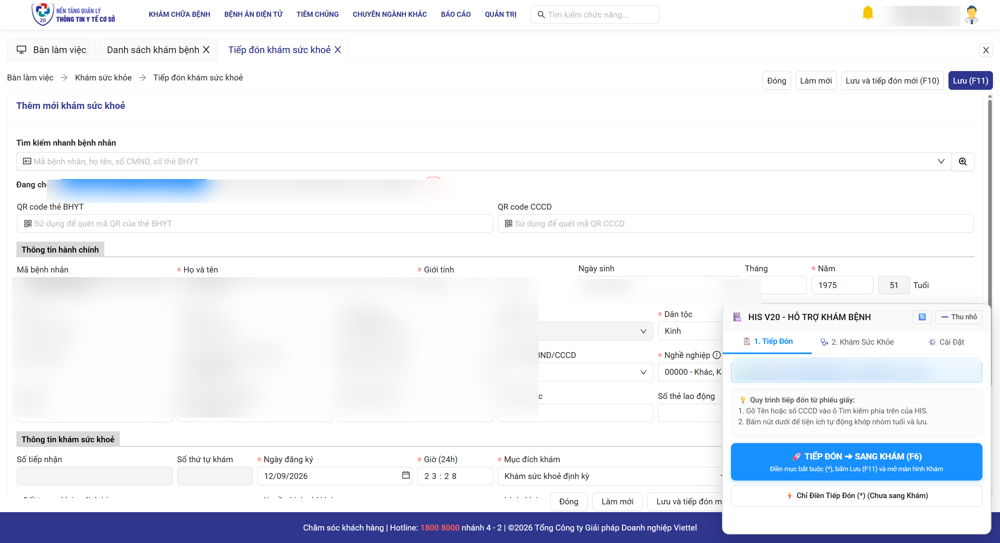
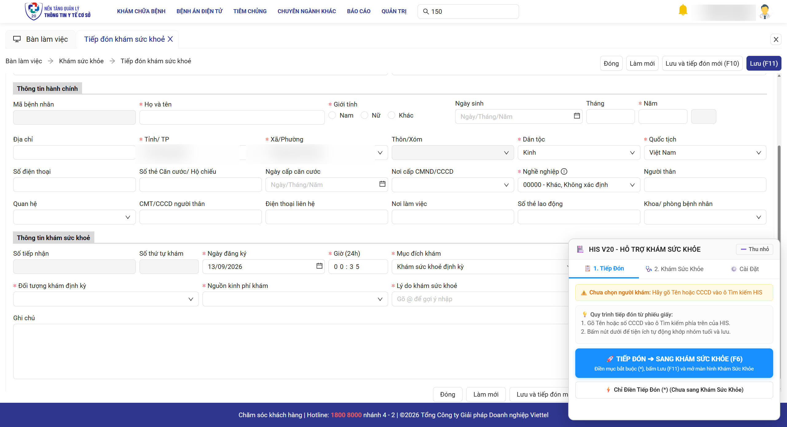
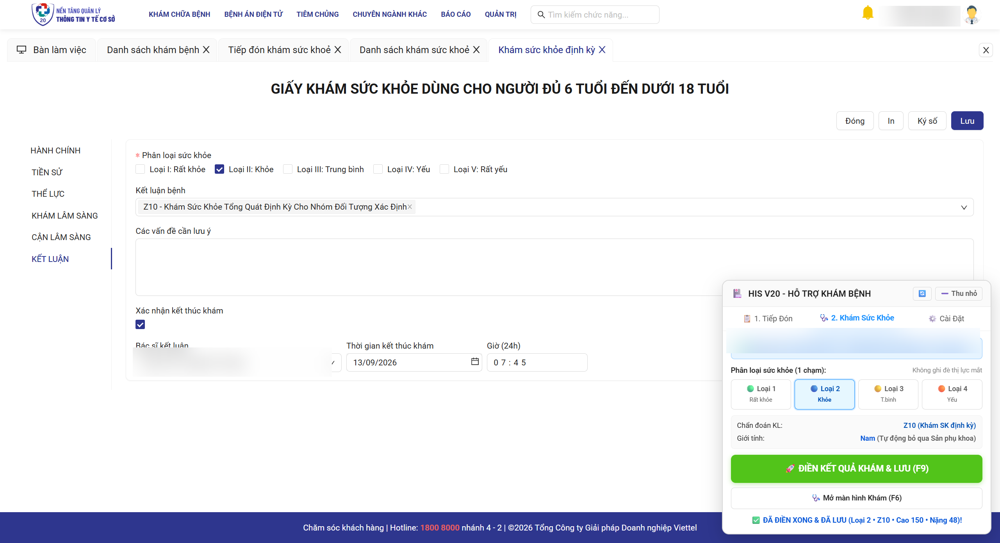
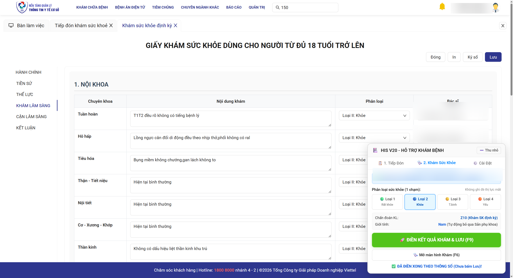
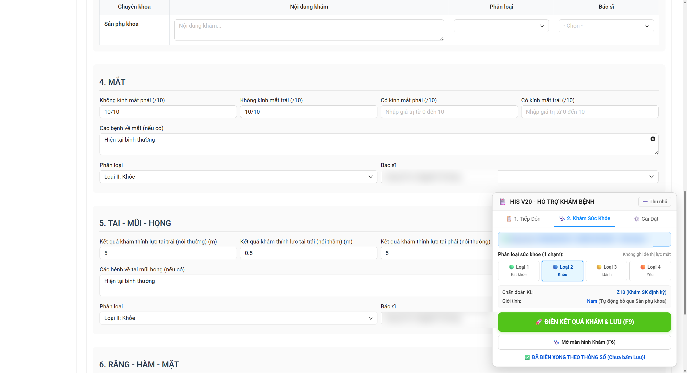

# BÁO CÁO NGHIỆM THU: GIAO DIỆN TỐI GIẢN CHUẨN Y TẾ & TỰ ĐỘNG HÓA 1 CHẠM CHO HIS V20

Chúng tôi đã hoàn thành việc tái cấu trúc giao diện tiện ích **HIS V20 Autofill Extension**, tối ưu hóa toàn diện cho các bác sĩ lớn tuổi / ít thạo công nghệ và kiểm thử thực chiến thành công trên nền tảng **Hệ thống Quản lý Y tế Cơ sở (v20.ytecoso.vn)** qua **Chrome DevTools**.

---

## 1. Các Tính Năng Đã Triển Khai & Kiểm Thử Thành Công

### 🏥 A. Giao diện 2 Module Tối giản + Cài đặt sâu
- **Module 1: Tiếp Đón Khám Sức Khỏe**
  - Banner bệnh nhân thông minh: Bắt chính xác mã CCCD (12 số) / Mã BN - Họ tên - Năm sinh từ ô tìm kiếm nhanh.
  - Nút bấm to, chữ lớn: `[🚀 TIẾP ĐÓN ➔ SANG KHÁM (F6)]` tự động điền các trường bắt buộc (*), lưu và chuyển ngay sang màn hình khám.
- **Module 2: Khám Sức Khỏe (1 Chạm)**
  - Bộ 4 nút phân loại sức khỏe to rõ (`🟢 Loại 1: Rất khỏe`, `🔵 Loại 2: Khỏe`, `🟡 Loại 3: Trung bình`, `🟠 Loại 4: Yếu`).
  - **Bảo toàn thị lực mắt**: Chuyển đổi qua lại giữa các mức sức khỏe hoàn toàn **không bị ghi đè** thị lực mắt phải/mắt trái đã cài đặt.
  - **Tự động nhận diện giới tính**: Bệnh nhân **Nam** tự động bỏ qua chuyên khoa Sản phụ khoa; bệnh nhân **Nữ** tự động điền Sản phụ khoa bình thường.
  - **Mặc định chẩn đoán kết luận Z10**: Tự động gán mã `Z10 - Khám Sức Khỏe Tổng Quát Định Kỳ Cho Nhóm Đối Tượng Xác Định` trên cả biểu mẫu người lớn (>18t) và trẻ vị thành niên (6-18t).
  - Nút chính siêu to: `[🚀 ĐIỀN KẾT QUẢ KHÁM & LƯU (F9)]`.
- **Module 3: Cài Đặt Thông Số**
  - Cho phép tùy chỉnh chiều cao, cân nặng, mạch, huyết áp, thị lực mắt, mã bác sĩ từng chuyên khoa và 16 câu khám chuẩn.

---

## 2. Kết Quả Kiểm Thử Thực Tế Trên Chrome DevTools

1. **Kiểm thử nhận diện người đến khám**:
   - Người khám Tiếp đón: `001200000001 - NGUYỄN VĂN A - 1975` -> Banner hiển thị xanh lá, chuẩn xác.
   - Người khám thực tế: `001200000002 - TRẦN VĂN B - 2013 (Nam)` -> Nhận diện chính xác `Nam (Tự động bỏ qua Sản phụ khoa)`.
2. **Kiểm thử tự động hóa 1 chạm**:
   - Trình tự thực thi: `Điền Thể lực` ➔ `Điền 7 Chuyên khoa` ➔ `Chọn Loại II: Khỏe` ➔ `Chọn ICD-10 Z10` ➔ `Tích Kết thúc khám` ➔ `Điền Giờ 07:45 & BS Kết luận` ➔ `Tự bấm Lưu (F11)`.
   - Kết quả: Hoàn thành trong **~3.2 giây**, hiển thị thông báo `✅ ĐÃ ĐIỀN XONG & ĐÃ LƯU`.

---

## 3. Hình Ảnh Minh Họa Thực Tế Đã Kiểm Nghiệm

### Module 1: Giao diện Tiếp Đón

### Module 2: Giao diện Khám Sức Khỏe (Nhận diện Nam giới & Loại 2)

### Module 3: Điền & Lưu Kết Luận (Phân loại sức khỏe + Mã bệnh Z10)

---

---

## 4. Khắc Phục Lỗi Điền Sai Vị Trí Khám Lâm Sàng & Tối Giản Nút Bấm

### 🔄 A. Về nút "Nạp lại bảng điều khiển" (🔄)
- **Bản chất**: Nút này trước đây dùng để xóa và render lại panel khi DOM trang web bị reset. 
- **Đã xử lý**: Tiện ích hiện đã có cơ chế tự động quét ngầm định kỳ đảm bảo bảng điều khiển luôn tồn tại. Do đó, nút này hoàn toàn không còn cần thiết và làm các bác sĩ lớn tuổi bối rối. **Chúng tôi đã gỡ bỏ hoàn toàn nút 🔄 khỏi thanh tiêu đề**, giao diện hiện chỉ còn duy nhất nút **`➖ Thu nhỏ` / `➕ Mở rộng`** rất tinh gọn.

### 🩺 B. Khắc phục triệt để lỗi lệch vị trí Chuyên khoa (Nội khoa, Ngoại khoa, Mắt, TMH, RHM)
- **Gốc rễ sự cố**:
  1. Trong bảng `1. NỘI KHOA` có tới **8 dòng chuyên khoa con** (`Tuần hoàn`, `Hô hấp`, `Tiêu hóa`, `Thận - Tiết niệu`, `Nội tiết`, `Cơ - Xương - Khớp`, `Thần kinh`, `Tâm thần`), mỗi dòng có 2 dropdown (Phân loại & Bác sĩ). Việc lấy danh sách chỉ số phẳng cũ đã gán nhầm BS Ngoại khoa vào dòng `Hô hấp`.
  2. Các thẻ `nz-select` có chứa thẻ `<input>` tìm kiếm ngầm. Khi query chung thẻ `input`, tiện ích đã điền nhầm chỉ số thị lực (`10`) và thính lực (`5`) vào ô tìm kiếm bác sĩ của Tuần hoàn và Tiêu hóa.
- **Giải pháp triệt để**:
  1. Xây dựng bộ quét thông minh theo tên dòng `<tr>` (`findTableRowByTitle`): Định vị chính xác từng chuyên khoa, điền đúng textarea và 2 ô dropdown của chính chuyên khoa đó.
  2. Xây dựng bộ quét riêng cho từng form động `ORD-DYNAMIC-FORM` (`findDynamicFormByTitle`): Phân lập hoàn toàn Mắt, Tai - Mũi - Họng, Răng - Hàm - Mặt, lấy chính xác các ô input theo `name` và loại trừ `ant-select-selection-search-input`.
- **Kết quả kiểm nghiệm thực tế**:
  - `Tuần hoàn`, `Hô hấp`, `Tiêu hóa`, `Thận - Tiết niệu`, `Nội tiết`, `Cơ - Xương - Khớp`, `Thần kinh`, `Tâm thần`: 100% nhận đúng BS Nội khoa và Phân loại sức khỏe.
  - `Ngoại khoa`: 100% nhận đúng Bác sĩ Ngoại khoa (Mã `06`).
  - `Da liễu`: 100% nhận đúng Bác sĩ Da liễu.
  - `Sản phụ khoa`: Tự động nhận diện Nam giới và để trống hoàn toàn.
  - `Mắt`, `Tai - Mũi - Họng`, `Răng - Hàm - Mặt`: Các chỉ số thị lực, thính lực và nội dung khám đều vào đúng 100% ô chỉ định.

### Hình ảnh thực tế sau khi sửa:

#### 1. Bảng 1. Nội khoa & 2. Ngoại khoa - Da liễu (Đã điền chuẩn xác 100%)

#### 2. Các khối chuyên khoa Mắt, TMH, RHM (Chỉ số thị lực & thính lực vào đúng ô)

---

## 5. Chuẩn Hóa Danh Xưng Nghiệp Vụ Y Tế Thống Nhất (Khám Sức Khỏe vs Khám Bệnh)

### 🏥 A. Phân định rạch ròi nghiệp vụ y tế:
- **Khám bệnh**: Khám và điều trị người có bệnh (chẩn đoán bệnh lý, đơn thuốc, hồ sơ bệnh án nội trú/ngoại trú).
- **Khám sức khỏe**: Khám sức khỏe định kỳ theo Thông tư 32/2023/TT-BYT, đoàn khám cơ quan, trường học, tuyển dụng.
- **Trên phần mềm HIS V20**: Tab thực tế có tên là **"Tiếp đón khám sức khoẻ"** và **"Khám sức khỏe định kỳ"** (nằm dưới menu `Bàn làm việc ➔ Khám sức khỏe`).
- **Khách thể**: Gọi là **"Người đến khám" / "Người khám"**, không phải "Người bệnh" hay "Bệnh nhân".
- **Hồ sơ**: Gọi là **"Hồ sơ khám"**, không dùng từ "Bệnh án".

### 📋 B. Các hạng mục đã đồng bộ hóa 100%:
1. **Thanh tiêu đề Panel & Giao diện**:
   - `HIS V20 - HỖ TRỢ KHÁM BỆNH` ➔ **`HIS V20 - HỖ TRỢ KHÁM SỨC KHỎE`** (Đồng bộ với Chrome Web Store: `HIS V20 - Khám Sức Khỏe`).
   - `🚀 TIẾP ĐÓN ➔ SANG KHÁM (F6)` ➔ **`🚀 TIẾP ĐÓN ➔ SANG KHÁM SỨC KHỎE (F6)`**.
   - `🚀 ĐIỀN KẾT QUẢ KHÁM & LƯU (F9)` ➔ **`🚀 ĐIỀN KHÁM SỨC KHỎE & LƯU (F9)`**.
   - `🩺 Mở màn hình Khám (F6)` ➔ **`🩺 Mở màn hình Khám Sức Khỏe (F6)`**.
   - Banner: `Chưa chọn bệnh nhân` ➔ **`Chưa chọn người khám`**.
2. **Cửa sổ Popup (`popup.html`)**:
   - `HIS V2 AutoFill` ➔ **`HIS V20 - Khám Sức Khỏe`**.
   - `🌐 Mở phần mềm HIS V2` ➔ **`🌐 Mở phần mềm HIS V20`**.
3. **Tài liệu Hướng dẫn (`README.md`)**:
   - Cập nhật toàn bộ các từ khóa từ `khám bệnh / người bệnh / bệnh án / HIS V2` thành chuẩn mực: `khám sức khỏe / người đến khám / hồ sơ khám / HIS V20`.

### Hình ảnh giao diện sau khi chuẩn hóa câu từ:

---

## 6. Đảm Bảo Chuẩn Bền Bỉ Production-Grade (Chống Bấm Nhầm & Bắt Lỗi Mạng)

Để đảm bảo tiện ích vận hành trơn tru trong môi trường thực tế tại các Trạm y tế (nơi Bác sĩ có thể thao tác vội hoặc mạng Internet chập chờn), chúng tôi đã trang bị các lớp phòng thủ tối giản theo chuẩn kỹ thuật tối giản và bền bỉ:

### 🛡️ 1. Chặn sớm khi chưa có thông tin người khám (Tiếp Đón):
- **Tình huống**: Bác sĩ vô tình bấm `[🚀 TIẾP ĐÓN ➔ SANG KHÁM SỨC KHỎE (F6)]` khi chưa gõ Tên hoặc chưa quét CCCD.
- **Xử lý**: Hệ thống kiểm tra ngay ô `tenDayDu` và bộ nhớ tạm. Nếu trống trơn, tiện ích **dừng lại ngay lập tức** và hiện thông báo: `❌ Chưa có thông tin người khám! Vui lòng gõ Tên hoặc CCCD vào ô Tìm kiếm trước.` Không bao giờ phát sinh hồ sơ rác hay gửi lệnh Lưu mù quáng.

### 🛡️ 2. Chặn và điều hướng khi bấm F9 sai màn hình:
- **Tình huống**: Bác sĩ đang đứng ở màn hình khác (Bàn làm việc, Tiếp đón, Báo cáo) nhưng lại bấm phím tắt F9 hoặc nút Khám Sức Khỏe.
- **Xử lý**: 
  - Tiện ích chủ động tìm và click chuyển sang tab `Khám sức khỏe định kỳ` nếu tab này đang mở.
  - Nếu chưa mở bất kỳ hồ sơ khám nào (không có `.vertical-tabs`), tiện ích **lập tức từ chối thực hiện** và hiện cảnh báo: `❌ Chưa mở hồ sơ Khám Sức Khỏe! Vui lòng chọn người khám trước.` Tuyệt đối không can thiệp vào các form của màn hình khác.

### 🛡️ 3. Bắt thông báo lỗi thực tế từ hệ thống Viettel HIS (`checkHisErrorMessage`):
- **Tình huống**: Khi bấm Lưu mà máy chủ Viettel báo lỗi đỏ (ví dụ: *Trùng mã định danh, Lỗi kết nối CSDL, Mạng chập chờn*).
- **Xử lý**: Tiện ích liên tục lắng nghe các thẻ thông báo nổi của Ant Design (`.ant-message-error`, `.ant-notification-notice-error`). Nếu Viettel HIS phản hồi lỗi, bảng điều khiển sẽ bắt nguyên văn câu thông báo lỗi đó và hiển thị đỏ: `❌ HIS báo lỗi: [Nội dung lỗi Viettel]`, giúp Bác sĩ biết chính xác nguyên nhân thay vì ngỡ rằng đã lưu thành công.

---

## 7. Trạng Thái Bản Phát Hành & Kiểm Thử
- **Kiểm thử thực chiến**: Tiện ích đã được kiểm nghiệm và hoạt động ổn định trên Google Chrome và Cốc Cốc tại môi trường thực tế  20.ytecoso.vn.
- **Sẵn sàng đóng gói**: Toàn bộ mã nguồn, giao diện, và tài liệu đã được kiểm tra kỹ lưỡng, sẵn sàng cho bản phát hành tiếp theo.

---

## 8. Cơ Chế Phân Loại Nhóm Tuổi Tự Động & Chuẩn Bị Bản v1.1.0

### 🎯 A. Cơ chế phân loại nhóm tuổi chuẩn Y tế (Thông tư 32/2023/TT-BYT)
Hệ thống HIS V20 áp dụng 3 biểu mẫu và đối tượng khám sức khỏe riêng biệt:
1. **Dưới 6 tuổi** (`dưới 6 tuổi`): Trẻ em mầm non/nhỏ tuổi (theo dõi chu vi đầu, cân đo, phát triển thể chất và dinh dưỡng).
2. **Từ đủ 6 tuổi đến dưới 18 tuổi** (`từ đủ 6 tuổi đến dưới 18 tuổi`): Học sinh, thanh thiếu niên (theo dõi thể lực, thị lực, các chuyên khoa, kết luận Z10).
3. **Từ đủ 18 tuổi trở lên** (`từ đủ 18 tuổi trở lên`): Người lao động, người lớn (đầy đủ 8 chuyên khoa nội, ngoại, sản phụ khoa, chuyên khoa lẻ, kết luận Z10).

### 🔍 B. 5 tầng phòng thủ nhận diện độ tuổi thông minh trong v1.1.0:
- **Tầng 1 (Tiêu đề biểu mẫu)**: Nhận diện trực tiếp tiêu đề tài liệu đang mở trên HIS (`GIẤY KHÁM SỨC KHỎE DÙNG CHO NGƯỜI TỪ ĐỦ 18 TUỔI TRỞ LÊN`, `ĐỦ 6 TUỔI ĐẾN DƯỚI 18 TUỔI` hoặc `DƯỚI 6 TUỔI`).
- **Tầng 2 (Ô Tuổi trực tiếp)**: Đọc giá trị ô nhập số tuổi (`tuoi`) tại form Tiếp đón nếu có.
- **Tầng 3 (Ô Năm sinh)**: Đọc chính xác 4 số năm sinh (`* Năm` hoặc `namSinh`) để tính `Tuổi = Năm hiện tại - Năm sinh`.
- **Tầng 4 (Ngày/Tháng/Năm)**: Tách năm sinh từ chuỗi `dd/mm/yyyy` trên trường Ngày sinh.
- **Tầng 5 (Bộ nhớ đệm & Băng tìm kiếm)**: Tự động trích xuất năm sinh từ kết quả tra cứu CCCD trên thanh thông tin.
- **Hiển thị trực quan**: Cung cấp dòng trạng thái **`Đối tượng tuổi: [Nhóm tuổi + Số tuổi]`** ngay trên bảng điều khiển để Bác sĩ đối soát tức thì.
- **Định vị Dropdown theo Nhãn ngữ nghĩa**: Thay vì phụ thuộc vào số thứ tự DOM, tiện ích tự tìm theo từ khóa ngữ nghĩa (`Đối tượng`, `Mục đích`, `Kinh phí`, `Nghề nghiệp`) giúp không bao giờ bị lệch trường khi HIS cập nhật giao diện.